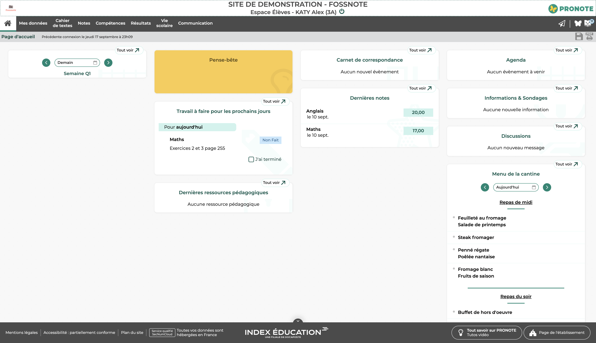
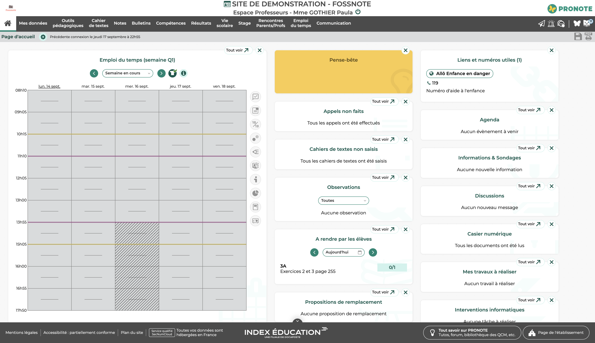

<p align="center">
  
</p>

Fossnote est un serveur alternatif "PRONOTE" gratuit, open-source et auto-hébergeable (Free Open Source Selfhostable PRONOTE). 
Conçu pour être compatible avec le client web officiel de PRONOTE, il permet aux établissements ou aux développeurs de reprendre le contrôle de leurs données scolaires en toute transparence.

---

## Fonctionnalités implémentées

L'application est divisée entre des interfaces web (front-end) et une API émulant le comportement de PRONOTE (back-end).

### Espaces Web (Front-end)
- **Portail d'index** : Page de sélection des différents espaces (`/fossnote/`).
- **Espace Élèves** : Panel de connexion implémenté avec accès à la page d'accueil, aux informations personnelles, aux notes et au cahier de textes (`/fossnote/eleve.html`).
  
  
  
- **Espace Professeurs** : Panel de connexion implémenté avec accès à la page d'accueil (`/fossnote/professeur.html`).

  

- **Autres espaces** : Les pages de connexion sont présentes (en statique) pour la Vie scolaire, les Parents, les Accompagnants et la Direction.

### Serveur et Protocoles (Back-end)
Fossnote implémente le système de communication de PRONOTE :
- **Sécurité et Sessions** : 
  - Génération d'identifiants de session liés à l'horodatage.
  - Résolution du défi d'authentification (génération et vérification de `alea` et `challenge`).
  - Stockage des sessions via SQLite (`database.db`).
- **Requêtes système partagées** : Prise en charge de `FonctionParametres`, `Identification`, `Authentification` et `ParametresUtilisateur`.
- **Méthodes Espace Élèves** : Prise en charge de `PageAccueil`, `DernieresNotes`, `PageInfosPerso` et `PageCahierDeTexte`.
- **Méthodes Espace Professeurs** : Prise en charge de `PageAccueil`, `listeClassesGroupes`, `ListePeriodes` et `ListeRessources`.
- **Méthodes générales** : Gestion basique de la `Navigation` et de la `Presence` pour le maintien de session.

---

## Installation et Démarrage

Fossnote utilise **[Bun](https://bun.sh/)** comme environnement d'exécution, offrant des performances optimales.

1. **Cloner le dépôt :**
   ```bash
   git clone https://github.com/xFufly/fossnote.git
   cd fossnote
   ```

2. **Installer les dépendances :**
   ```bash
   bun install
   ```

3. **Initialiser la base de données :**
   Cette étape crée les tables requises et injecte les données de test.
   ```bash
   bun run db:push
   bun run db:seed
   ```

4. **Lancer le serveur de développement :**
   ```bash
   bun run dev
   ```

Une fois le serveur démarré, rendez-vous sur : `http://localhost:3000/fossnote/`

---

## Identifiants de démonstration

Des comptes de test sont créés automatiquement lors de l'exécution de la commande `db:seed` :

| Espace | Identifiant | Mot de passe |
| :--- | :--- | :--- |
| **Élève** | `akaty` | `Password123!` |
| **Professeur** | `pgothier` | `Password123!` |

---

## Architecture Technique

- **Serveur Web** : [Bun](https://bun.sh/) couplé au framework [Hono](https://hono.dev/).
- **Base de données** : SQLite (via le pilote `better-sqlite3`).
- **ORM** : [Drizzle ORM](https://orm.drizzle.team/).

Pour administrer la base de données de manière visuelle, vous pouvez utiliser Drizzle Studio :
```bash
bun run db:studio
```

---

## Protocoles Client / Serveur

La documentation détaillée des protocoles réseau échangés entre le client officiel et le serveur Fossnote est en cours de rédaction.

---

## Licence et Droits d'auteur

**Copyright (c) 2023-2026 Tim DIDELOT • LittleGlory (SIRET 109 055 707 00011)**

Ce projet est sous licence **GNU AGPLv3**.
L'AGPLv3 (Affero General Public License) garantit que toute personne ou organisation qui modifie ce code source et l'héberge en tant que service réseau doit également rendre publiques ses modifications (open-source) sous la même licence.

---

## Crédits

Ce projet open-source a été créé et est maintenu par **[Tim DIDELOT](https://timdidelot.fr)**.
